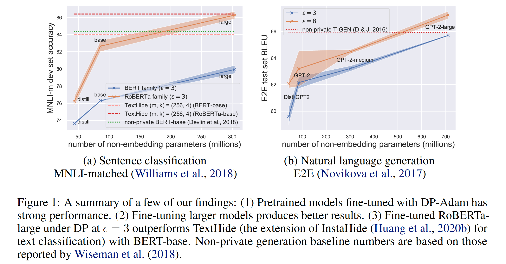

# private-transformers

This codebase facilitates fast experimentation of differentially private training
of [Hugging Face transformers](https://huggingface.co/transformers/).

---
<p align="center">
  
</p>

## What is this? Why an extra codebase?

- This codebase provides a privacy engine that builds off and rewrites [Opacus](https://github.com/pytorch/opacus) so
  that integration with
  [Hugging Face's transformers library](https://github.com/huggingface/transformers) is easy.
- Additionally, we support the *ghost clipping* technique (see Section 4 of [this](https://arxiv.org/pdf/2110.05679.pdf)
  preprint on how it works) which allows privately training large transformers with considerably reduced memory cost --
  in many cases, almost as light as non-private training -- at a modest run-time overhead.
- **With this codebase, we have fine-tuned very large pretrained models, yielding some of the best performing
  differentially private NLP models to date. Some of these models have performance matching strong non-private baseline
  approaches. We see strong empirical evidence that highly performant DP NLP models could be built on modest datasets.**

## Installation

Make sure you have python>=3.8; run the following command:

```bash
pip install git+https://github.com/lxuechen/private-transformers.git
```

To check the package is installed properly, be sure to run the test suite (requires pytest and a GPU) via the following
command:

```bash
pytest -s tests
```

## Usage

### Basic usage

Privately training Hugging Face transformers with our codebase simply consists of 4 steps:

1. Create your favourite transformer model and optimizer; attach this optimizer to a `PrivacyEngine`
2. Compute a per-example loss (1-D tensor) for a mini-batch of data
3. Pass the loss to `optimizer.step` or `optimizer.virtual_step` as a keyword argument
4. Repeat from step 2

Below is a quick example:

```python
import transformers, torch
from private_transformers import PrivacyEngine
import torch.nn.functional as F

device = torch.device('cuda' if torch.cuda.is_available() else 'cpu')
model = transformers.GPT2LMHeadModel.from_pretrained('distilgpt2').to(device)
optimizer = torch.optim.Adam(params=model.parameters(), lr=1e-4)
privacy_engine = PrivacyEngine(
    model,
    batch_size=10,
    sample_size=50000,
    epochs=3,
    max_grad_norm=0.1,
    target_epsilon=3,
)
privacy_engine.attach(optimizer)

batch_size, seq_len = 10, 20
# Inputs are batch-first format, i.e., the first dimension of tensors must be batch dimension.
input_ids = torch.randint(size=[batch_size, seq_len], low=0, high=100, device=device)
# Calling `.train()` is very important; otherwise underlying forward and backward hooks don't run.
model.train()
outputs = model(input_ids=input_ids, return_dict=True)
labels = input_ids[:, 1:, ]
logits = outputs.logits[:, :-1, :].permute(0, 2, 1)
# `loss` is a 1-D tensor of shape (batch_size,).
loss = F.cross_entropy(logits, labels, reduction="none").mean(dim=1)
# This step is different from existing workflows: 
#   Don't call `loss.backward`; leave it to `optimizer.step` to handle backward.
optimizer.step(loss=loss)
```

The biggest differences compared to Opacus are:

- We require the per-example loss (a 1-D tensor) be passed into `optimizer.step` (or `optimizer.virtual_step`).
- The per-example loss must be passed in as a *keyword argument*.
- `loss.backward()` shouldn't be called on the user end; it's called internally in `optimizer.step` (
  or `optimizer.virtual_step`).
- Inputs should be in batch-first format; there isn't a toggle to switch between different formats in the engine.

### Ghost clipping: memory saving differentially private learning

Turning on ghost clipping requires changing only 1 line. You should notice a drastic reduction in peak GPU memory usage
once this is turned on, at a potential cost of slower training speed. One might find this especially useful when
constrained to only use older GPUs with small VRAMs or fitting super large models.

```python
import transformers, torch
from private_transformers import PrivacyEngine

device = torch.device('cuda' if torch.cuda.is_available() else 'cpu')
model = transformers.GPT2LMHeadModel.from_pretrained('distilgpt2').to(device)
optimizer = torch.optim.Adam(params=model.parameters(), lr=1e-4)
privacy_engine = PrivacyEngine(
    model,
    batch_size=10,
    sample_size=50000,
    epochs=3,
    max_grad_norm=0.1,
    target_epsilon=3,
    clipping_mode="ghost",  # The only change you need to make!
)
privacy_engine.attach(optimizer)
```

### Examples

Code in the `examples` folder roughly reproduces our results for the table-to-text and classification tasks. There may
be some minor discrepancies, since hyperparameters there aren't exactly what's used in the paper. Nevertheless, it
should be sufficient to get things started. Detailed instructions are in the readme file of each subfolder.

### Currently supported [Hugging Face models](https://huggingface.co/transformers/pretrained_models.html)

- [OpenAIGPTLMHeadModel](https://huggingface.co/docs/transformers/model_doc/openai-gpt#transformers.OpenAIGPTLMHeadModel)
- [OpenAIGPTDoubleHeadsModel](https://huggingface.co/docs/transformers/model_doc/openai-gpt#transformers.OpenAIGPTDoubleHeadsModel)
- [GPT2LMHeadModel](https://huggingface.co/docs/transformers/model_doc/gpt2#transformers.GPT2LMHeadModel)
- [GPT2DoubleHeadsModel](https://huggingface.co/docs/transformers/model_doc/gpt2#transformers.GPT2DoubleHeadsModel)
- [BertForSequenceClassification](https://huggingface.co/docs/transformers/model_doc/bert#transformers.BertForSequenceClassification)
- [RobertaForSequenceClassification](https://huggingface.co/docs/transformers/model_doc/roberta#transformers.RobertaForSequenceClassification)
- [AlbertForSequenceClassification](https://huggingface.co/docs/transformers/model_doc/albert#transformers.AlbertForSequenceClassification)
- [BartForConditionalGeneration](https://huggingface.co/docs/transformers/model_doc/bart#transformers.BartForConditionalGeneration)
  (when positional embedding layers are frozen)
- [T5ForConditionalGeneration](https://huggingface.co/docs/transformers/v4.20.1/en/model_doc/t5#transformers.T5ForConditionalGeneration)
- [OPTForCausalLM](https://huggingface.co/docs/transformers/model_doc/opt#transformers.OPTForCausalLM)
- [ViTForImageClassification](https://huggingface.co/docs/transformers/v4.20.1/en/model_doc/vit#transformers.ViTForImageClassification)
  (when isolated parameters are frozen; see [this example](examples/image_classification/main.py))
- [DeiTForImageClassification](https://huggingface.co/docs/transformers/model_doc/deit#transformers.DeiTForImageClassification)
  (when isolated parameters are frozen)
- [BeitForImageClassification](https://huggingface.co/docs/transformers/model_doc/beit#transformers.BeitForImageClassification)
  (when isolated parameters are frozen)

Not all models in the Hugging Face library are supported. The main additional work to support a model is to

1. Support per-example gradients for bespoke modules
   (e.g., [T5LayerNorm](https://huggingface.co/transformers/_modules/transformers/modeling_t5.html)), and
2. Ensure `position_ids` are repeated (duplicated along batch dim 0). Normally, to save memory, one creates positional
   embedding for one instance and rely on broadcasting when there're multiple instances within a batch. This creates a
   problem with per-sample gradient accumulation, so we instead duplicate inputs to positional embeddings.

We plan to support more models in the future if there's such a need. Feel free to open an issue if you may want to try
out specific models that aren't in the current list.

## FAQ

I wrote some stuff to potential questions [here](https://github.com/lxuechen/private-transformers/blob/main/FAQ.md).
These include performing gradient accumulation, ghost clipping, and freezing parts of a model.

## Acknowledgements

It would have been impossible to develop this codebase without cool past works and existing codebases. We roughly follow
the `PrivacyEngine` design in `Opacus==0.13.0`. We directly use
an [off-the-shelf package](https://github.com/microsoft/prv_accountant) for tightly tracking tradeoff functions while
composing multiple private mechanisms.

## Disclaimer

- This codebase is not yet production-grade, e.g., cryptographically secure PRNGs are required for sampling noise -- our
  codebase currently does not use these strong PRNGs as they tend to slow down training. This codebase also isn't immune
  to [floating point representation attacks](https://github.com/pytorch/opacus/pull/260).
- This codebase is born out of the need to experiment with various things for differentially private NLP rapidly. I've
  tried my best to write clean code, though parts of this codebase may be less tidy than I had hoped
  given the extremely tight timeline.

## Citation

If you found this codebase useful in your research, please consider citing:

```
@inproceedings{
li2022large,
title={Large Language Models Can Be Strong Differentially Private Learners},
author={Xuechen Li and Florian Tramer and Percy Liang and Tatsunori Hashimoto},
booktitle={International Conference on Learning Representations},
year={2022},
url={https://openreview.net/forum?id=bVuP3ltATMz}
}
```
